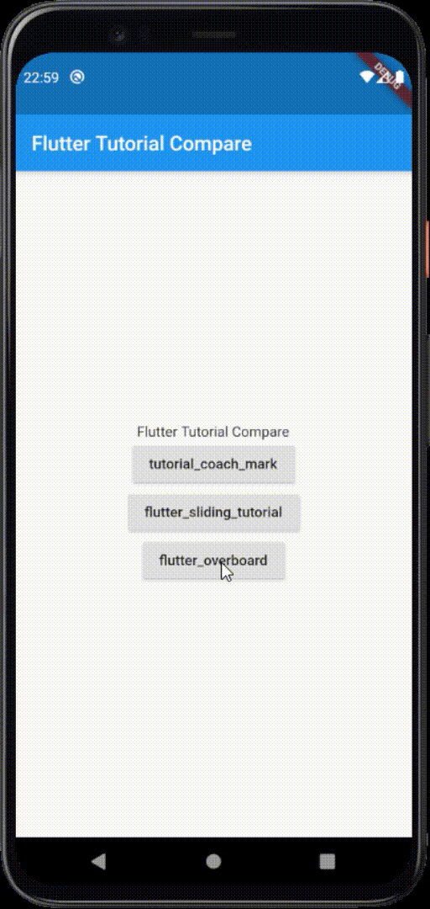
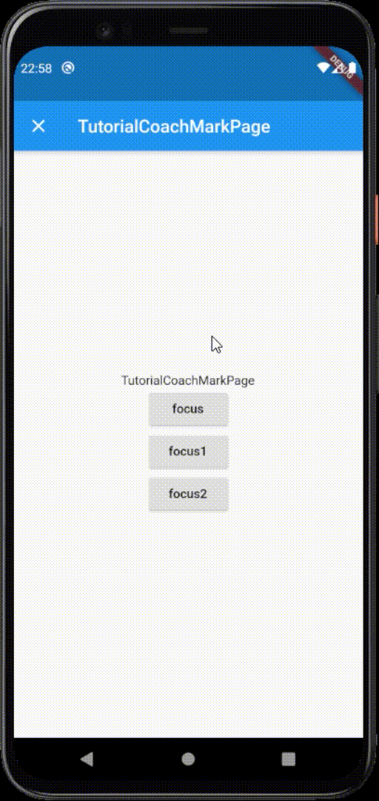

# Flutter Tutorial Compare 
  
A project to test the Flutter tutorial page as a sample  

## DEMO

## Libraries
- provider: 4.3.2+3  
- tutorial_coach_mark: 0.5.2  
- flutter_sliding_tutorial: 0.1.0  
- flutter_overboard: 1.1.5  

## License
Copyright (c) 2020 tokku5552  
This software is released under the MIT License.  
https://opensource.org/licenses/mit-license.php  

